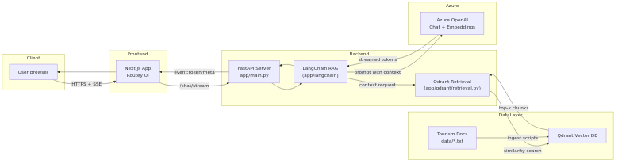

# Tourism Chatbot Architecture

The diagram below summarizes how the frontend, backend, vector database, and Azure OpenAI services interact across environments.

```mermaid
flowchart LR
    subgraph Client
        U[User Browser]
    end

    subgraph Frontend
        F[Next.js App\nRoutey UI]
    end

    subgraph Backend
        B[FastAPI Server\napp/main.py]
        LC[LangChain RAG\n(app/langchain)]
        QRET[Qdrant Retrieval\n(app/qdrant/retrieval.py)]
    end

    subgraph DataLayer
        QDB[(Qdrant Vector DB)]
        DATA[(Tourism Docs\ndata/*.txt)]
    end

    subgraph Azure
        AOAI[(Azure OpenAI\nChat + Embeddings)]
    end

    U -->|HTTPS + SSE| F
    F -->|/chat/stream| B
    B --> LC
    LC -->|context request| QRET
    QRET -->|similarity search| QDB
    QDB -->|top-k chunks| QRET
    LC -->|prompt with context| AOAI
    AOAI -->|streamed tokens| LC
    LC --> B -->|event:token/meta| F --> U

    DATA -->|ingest scripts| QDB
```

    

## Highlights
- **Transport:** Frontend communicates with FastAPI via HTTPS; responses stream using Server-Sent Events for low-latency updates.
- **Retrieval:** Every user turn triggers Qdrant similarity search via LangChain, ensuring answers cite relevant tourism documents.
- **Generation:** Azure OpenAI handles both embeddings (during ingest/retrieval) and chat completions (during user turns).
- **Deployment:** Docker Compose stack (deploy/*.compose.yml) spins up frontend, backend, and Qdrant containers; environment variables provide Azure credentials and collection settings.
